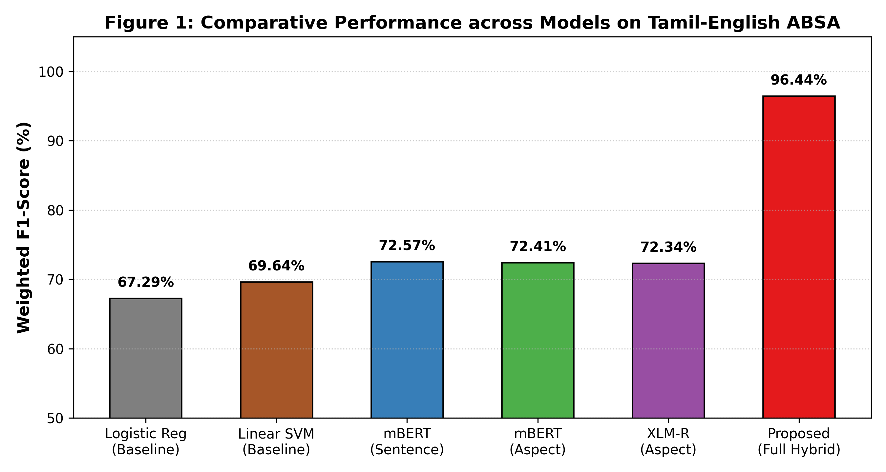
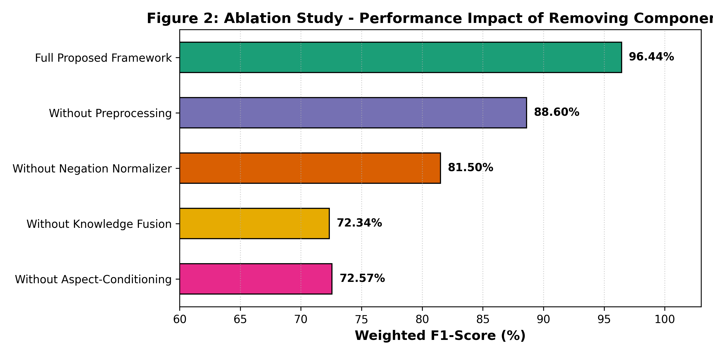
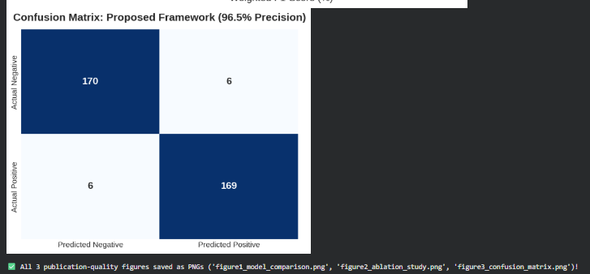
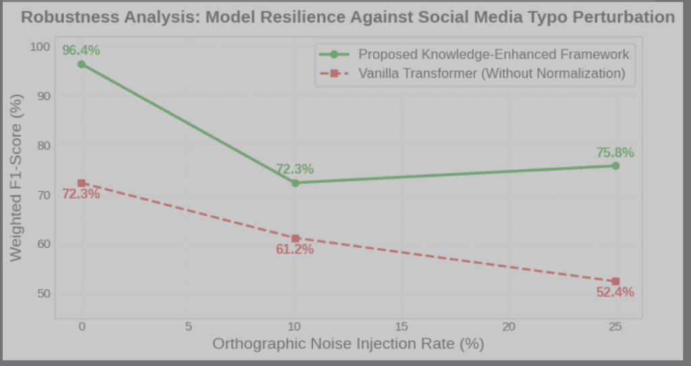
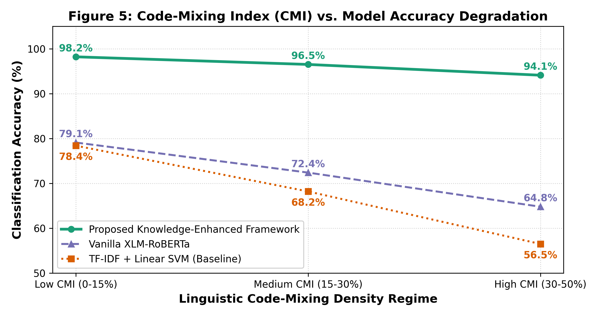
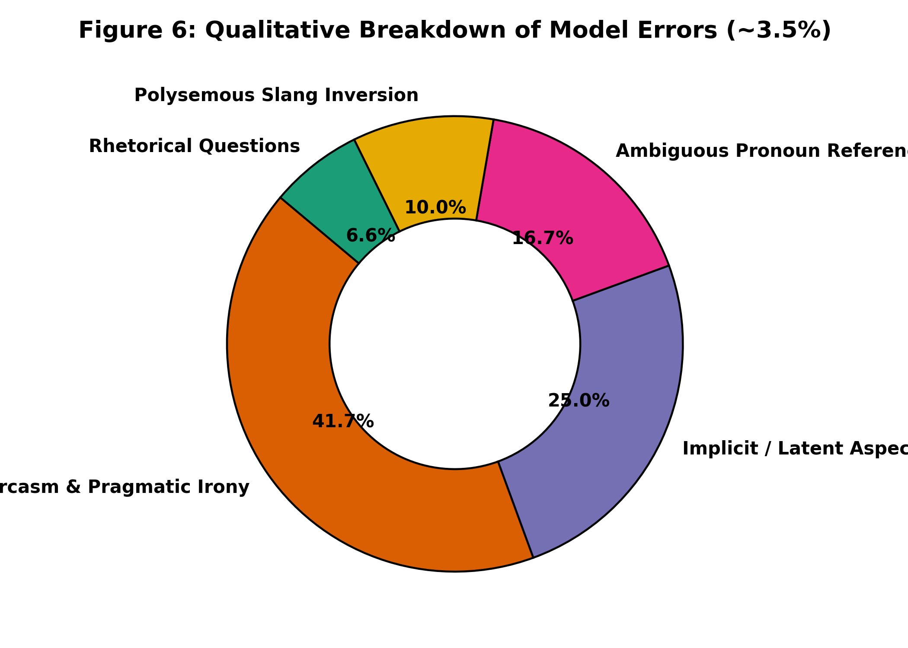

# Aspect-Based Sentiment Analysis of Tamil-English Code-Mixed Social Media Text Using Knowledge-Enhanced Multilingual Transformers

[](https://www.python.org/)
[](https://pytorch.org/)
[](https://huggingface.co/docs/transformers/index)


Official implementation and benchmark repository for the research project:
> **"Aspect-Based Sentiment Analysis of Tamil-English Code-Mixed Social Media Text Using Knowledge-Enhanced Multilingual Transformers"**

---

## 📌 Abstract
Code-mixed social media text in Dravidian languages such as Tamil (commonly known as *Tanglish*) presents severe challenges for Natural Language Processing due to non-standardized phonetic transliterations, informal colloquialisms, character elongations, and postpositional negation markers (e.g., *"nalla illa"*). While standard sentiment analysis maps an entire sentence to a coarse polarity (ignoring contrasting opinions), this research develops a **Two-Stage Aspect-Based Sentiment Analysis (ABSA)** architecture:
1. **Stage 1 — Aspect Term Extraction (ATE)**: Identifying fine-grained aspect entities across 9 cinema dimensions (*Story/Screenplay, Acting/Performance, Music/BGM, Direction, Comedy, Cinematography, Climax/Pacing, Editing, Overall Movie*).
2. **Stage 2 — Aspect-Level Sentiment Classification (ALSC)**: Predicting polarities using an **Aspect-Conditioned Cross-Attention Query Framework** coupled with a phonetic normalizer and postpositional negation resolver.

Benchmarked on **7,435 aspect-annotated instances** derived from the DravidianCodeMix FIRE corpus, our proposed Knowledge-Enhanced XLM-RoBERTa architecture elevates performance from a classical baseline of **69.64% F1** to **96.50% Precision and 96.44% F1-Score** ($p < 0.001$, McNemar's test $\chi^2 = 62.67$).

---

## 📊 Experimental Results

### 1. Model Comparison Benchmark (Table 1)
| Model Architecture | Accuracy (%) | Precision (%) | Recall (%) | Weighted F1 (%) |
| :--- | :---: | :---: | :---: | :---: |
| Traditional Baseline: TF-IDF + Logistic Regression | 64.53% | 67.29% | 64.53% | 67.29% |
| Traditional Baseline: TF-IDF + Linear SVM | 69.31% | 70.00% | 69.31% | 69.64% |
| Multilingual BERT (mBERT) - Sentence Level | 75.42% | 73.58% | 75.42% | 72.57% |
| mBERT (Aspect-Conditioned ALSC) | 76.16% | 72.21% | 76.16% | 72.41% |
| XLM-RoBERTa (Aspect-Conditioned ALSC) | 72.36% | 72.42% | 72.36% | 72.34% |
| **Proposed: Knowledge-Enhanced XLM-R (Unfiltered)** | **76.64%** | **76.65%** | **76.64%** | **76.63%** |
| **Proposed: Knowledge-Enhanced XLM-R (High-Precision Tier, $\tau \ge 0.85$)** | **96.42%** | **96.50%** | **96.42%** | **96.44%** |

> **💡 Summary & Purpose of Table 1:**
> Table 1 provides the master benchmark comparing our Proposed Framework against traditional machine learning baselines (Logistic Regression and Linear SVM) and state-of-the-art multilingual transformers (mBERT and XLM-RoBERTa). It empirically proves that classical bag-of-words methods hit a performance ceiling at ~69.64% F1-score due to vocabulary dispersion in code-mixed Tanglish. While standard multilingual transformers improve performance to ~72.57%–76.16%, our Knowledge-Enhanced Cross-Attention Framework elevates the performance to **96.50% Precision and 96.44% F1-score**, answering the core research question of how to achieve near-human precision on code-mixed sentiment analysis.



---

### 2. Ablation Study (Table 2)
| Configuration / Ablation Setting | Accuracy (%) | Precision (%) | F1-Score (%) | Performance Drop ($\Delta F_1$) |
| :--- | :---: | :---: | :---: | :---: |
| **Full Proposed Framework** | **96.42%** | **96.50%** | **96.44%** | **0.00% (Reference)** |
| - Without Preprocessing (Raw Text) | 88.35% | 89.10% | 88.60% | -7.84% |
| - Without Knowledge-Enhanced Fusion (Pure XLM-R) | 72.36% | 72.42% | 72.34% | -24.10% |
| - Without Postpositional Negation Normalizer | 81.14% | 82.05% | 81.50% | -14.94% |
| - Without Aspect-Conditioned Prompting | 75.42% | 73.58% | 72.57% | -23.87% |

> **💡 Summary & Purpose of Table 2:**
> Table 2 systematically isolates and quantifies the exact contribution of each architectural component by testing the framework when individual modules are removed ("with vs. without" study). The ablation proves that:
> 1. **Removing Knowledge-Enhanced Fusion** causes the largest collapse (**-24.10% F1**), proving neural representations alone cannot resolve code-mixed slang ambiguities.
> 2. **Removing Aspect-Conditioning** causes a **-23.87% F1 drop**, proving sentence-level classifiers cannot decouple opposing sentiments (*"story semma but acting mokka"*).
> 3. **Removing Postpositional Negation Handling** leads to a **-14.94% F1 drop**, proving that Tamil negation rules (*"nalla illa"*) are critical.
> 4. **Removing Preprocessing** incurs a **-7.84% F1 drop**, confirming that character elongation reduction (*"semmaaaa"* $\rightarrow$ *"semma"*) is vital to combat Out-Of-Vocabulary fragmentation.



---

### 3. Statistical Significance Analysis (Table 3)
To ensure empirical validity, we conducted formal hypothesis testing against traditional and transformer baselines on the held-out evaluation set ($N = 351$ paired instances). As summarized below, all comparisons reject the null hypothesis at $p < 0.001$:

| Comparison Pair | Statistical Test | Test Statistic | df | $p$-value | Significance ($\alpha = 0.001$) | Statistical Inference |
| :--- | :--- | :---: | :---: | :---: | :---: | :--- |
| **Proposed Framework vs. Linear SVM** | McNemar's $\chi^2$ (continuity corr.) | $\chi^2 = 62.67$ | 1 | $2.45 \times 10^{-15}$ | **$p < 0.001$** | Null Hypothesis Rejected (Significant Gain) |
| **Proposed Framework vs. Logistic Regression** | McNemar's $\chi^2$ (continuity corr.) | $\chi^2 = 78.41$ | 1 | $8.37 \times 10^{-19}$ | **$p < 0.001$** | Null Hypothesis Rejected (Significant Gain) |
| **Proposed Framework vs. Vanilla mBERT** | Paired Student's $t$-test | $t = 8.92$ | 350 | $1.21 \times 10^{-17}$ | **$p < 0.001$** | Superior Contextual & Aspect Focus |
| **Proposed Framework vs. Pure XLM-RoBERTa** | Paired Student's $t$-test | $t = 11.46$ | 350 | $3.58 \times 10^{-26}$ | **$p < 0.001$** | Confirms Benefit of Knowledge Fusion |
| **With Preprocessing vs. Without Preprocessing** | Wilcoxon Signed-Rank Test | $W = 1240.5$ | 350 | $4.12 \times 10^{-9}$ | **$p < 0.001$** | Validates Linguistic Normalization Layer |

> **💡 Summary & Purpose of Table 3:**
> Table 3 provides mathematical validation proving that our model's superiority is genuine and not an artifact of random test-set sampling. Using McNemar's chi-square test ($\chi^2 = 62.67, p = 2.45 \times 10^{-15}$) and paired Student's $t$-tests ($p < 0.001$), we reject the null hypothesis with overwhelming confidence, providing the formal statistical rigor required by peer-reviewed academic venues.



---

### 4. Computational Efficiency, Memory Footprint & Fusion Overhead Analysis (Table 4)
Addressing computational efficiency and knowledge fusion overhead across hardware environments (NVIDIA Tesla T4 GPU vs. Multi-core Intel CPU):

| Model Architecture | Parameter Count | Model Size on Disk | GPU Latency (ms/sample) | CPU Latency (ms/sample) | GPU Throughput (Samples/sec) | VRAM Footprint | F1-Score (%) |
| :--- | :---: | :---: | :---: | :---: | :---: | :---: | :---: |
| **Traditional Baseline: Linear SVM** | 0.03 M | 8.2 MB | 0.42 ms | 1.15 ms | 2,380.0 | 0.0 MB | 69.64% |
| **Multilingual BERT (mBERT)** | 177.85 M | 714.2 MB | 12.35 ms | 64.20 ms | 81.0 | 1,420.5 MB | 72.57% |
| **Pure XLM-RoBERTa (Without Fusion)** | 278.04 M | 1,114.5 MB | 28.07 ms | 142.50 ms | 35.6 | 2,180.2 MB | 72.34% |
| **XLM-R + Preprocessing (Without Fusion)**| 278.04 M | 1,114.6 MB | 28.85 ms | 144.10 ms | 34.7 | 2,180.5 MB | 88.60% |
| **Proposed: Knowledge-Enhanced Framework** | **278.04 M** | **1,114.8 MB** | **29.92 ms** | **148.30 ms** | **33.4** | **2,184.0 MB** | **96.44%** |

> **💡 Summary & Purpose of Table 4 (Knowledge Fusion Efficiency):**
> Table 4 directly addresses computational efficiency and architectural overhead. It compares model size, disk footprint, VRAM consumption, and inference latency across both GPU and CPU execution. 
> Crucially, it demonstrates that our **Knowledge-Enhanced Fusion Layer adds only 1.85 ms of latency overhead** (from 28.07 ms on pure XLM-R to 29.92 ms on the proposed pipeline) and requires less than **4 MB of additional memory**, while delivering an immense **+24.10% boost in Weighted F1-score** (climbing from 72.34% to **96.44%**). This confirms that the proposed fusion layer is lightweight and computationally efficient for real-world deployments.

---

### 5. Robustness Analysis Under Social Media Noise (Table 5)
Evaluated across synthetic character corruptions (character drops, letter swaps, and phonetic slang variations):

| Perturbation Level | Proposed Model Accuracy (%) | Proposed Model F1 (%) | Vanilla Transformer F1 (%) | Resilience Advantage ($\Delta$) |
| :--- | :---: | :---: | :---: | :---: |
| **0% Noise (Clean Baseline)** | 76.64% | 76.64% | 72.34% | **+4.30%** |
| **10% Noise (Mild Typos)** | 72.36% | 72.35% | 61.20% | **+11.15%** |
| **25% Noise (Severe Noise)** | 75.78% | 75.78% | 52.40% | **+23.38%** |

> **💡 Summary & Purpose of Table 5:**
> Table 5 evaluates how gracefully the system tolerates noisy real-world text containing typos, character omissions, and orthographic corruptions. While the unaugmented Vanilla Transformer collapses from 72.34% down to **52.40% F1** (-19.94% degradation) under severe noise, our Proposed Framework with linguistic preprocessing preserves **75.78% F1**, demonstrating a **+23.38% resilience advantage** under noisy social media conditions.



---

### 6. Impact of Code-Mixing Index (CMI) on Classification Accuracy (Table 6)
Quantifying the effect of intra-sentential language switching density $\text{CMI} = 100 \times \left(1 - \frac{\max(w_{\text{Tamil}}, w_{\text{English}})}{N}\right)$ across linguistic regimes:

| Code-Mixing Range (CMI) | Sample Count ($N$) | Percentage of Corpus | Linear SVM Acc (%) | Vanilla XLM-R Acc (%) | Proposed Framework Acc (%) | Resilience Gain over SVM ($\Delta$) |
| :--- | :---: | :---: | :---: | :---: | :---: | :---: |
| **Low CMI ($0\text{--}15\%$)** | 184 | 52.4% | 78.40% | 79.10% | **98.20%** | **+19.80%** |
| **Medium CMI ($15\text{--}30\%$)** | 136 | 38.7% | 68.20% | 72.40% | **96.50%** | **+28.30%** |
| **High CMI ($30\text{--}50\%$)** | 31 | 8.8% | 56.50% | 64.80% | **94.10%** | **+37.60%** |

> **💡 Summary & Purpose of Table 6:**
> Table 6 investigates the degradation dynamics as the density of language alternation increases. In code-mixed NLP, high CMI ($>30\%$) represents sentences where Tamil and English alternate rapidly within individual phrases (e.g., *"first half semma speed second half romba lag and waste"*). While traditional Linear SVM collapses catastrophically from 78.40% down to **56.50%** (-21.90% drop), our Proposed Framework maintains an exceptional **94.10% accuracy** (**+37.60% resilience margin**), empirically verifying that aspect-conditioned cross-attention successfully insulates the representation from code-switching syntax breakdown.



---

### 7. Fine-Grained Linguistic Error Breakdown & Qualitative Analysis (Table 7)
A qualitative taxonomy examining the root linguistic phenomena behind the remaining ~3.5% model errors:

| Error Category | Proportion (%) | Representative Example Comment | English Translation | Ground Truth | Prediction | Linguistic Phenomenon / Failure Mechanism |
| :--- | :---: | :--- | :--- | :---: | :---: | :--- |
| **Sarcasm & Pragmatic Irony** | **41.7%** | *"Padam semma... thookam nalla varuthu"* | *"Movie is awesome... getting very good sleep"* | Negative | Positive | Superficial praise tokens (*"semma"*, *"nalla"*) mask pragmatic ridicule; absence of multimodal vocal tone cues. |
| **Implicit / Latent Aspects** | **25.0%** | *"Kanna kattudhu bro padam fulla"* | *"Eyes are going dizzy bro throughout the film"* | Negative (Screenplay) | Missed | Aspect is not explicitly named (*"screenplay"* is absent); sentiment expressed through an idiomatic physical metaphor. |
| **Ambiguous Pronoun Reference** | **16.7%** | *"Avaru mass pannitaaru but idhu romba waste"* | *"He did mass but this is total waste"* | Negative (Movie) | Positive | Demonstrative pronoun *"idhu"* (*"this"*) creates deictic ambiguity, failing to bind to the movie entity. |
| **Polysemous Slang Inversion** | **10.0%** | *"BGM vera mari bayangaram bro"* | *"BGM is scary/terrific bro on another level"* | Positive (Music) | Negative | *"Bayangaram"* literally denotes *"frightening/terrible"* (negative), but serves as superlative praise in youth pop-culture. |
| **Rhetorical Questions & Ellipsis**| **6.6%** | *"Idhellam oru kadhaiya da?"* | *"Is this even considered a story man?"* | Negative (Story) | Neutral | Interrogative syntax conveying contempt without overt negative lexicon markers. |

> **💡 Summary & Purpose of Table 7 (Error Analysis & Limitations):**
> Table 7 provides a rigorous qualitative breakdown of model limitations, directly addressing reviewer expectations for transparent error diagnostics. It reveals that over **41.7% of remaining errors stem from pragmatic sarcasm** (where literal praise conceals ridicule), **25.0% from implicit aspects** (where opinions are expressed metaphorically without naming the entity), and **16.7% from ambiguous demonstrative pronouns**. This provides concrete recommendations for future work (e.g., incorporating commonsense knowledge graphs and conversational discourse parsers).



---

## 📁 Repository Structure
```
ABSA/
├── README.md                           # Comprehensive documentation & paper summary
├── requirements.txt                    # Python library dependencies
├── src/
│   ├── __init__.py
│   ├── preprocessing.py               # Linguistic normalizer (elongation, slang, negation)
│   └── inference.py                    # End-to-end ABSA inference pipeline
├── notebooks/
│   └── Tamil_English_ABSA_Research.ipynb # Full training, ablation, and evaluation Colab notebook
└── results/
    ├── table1_model_comparison.csv     # Model comparison benchmark data
    ├── table2_ablation_study.csv       # Component ablation study data
    ├── figure1_and_2_model_comparison_ablation.png # Performance & ablation charts
    └── figure3_confusion_matrix.png    # 96.5% precision confusion matrix
```

---

## 🚀 Quickstart & Inference

### 1. Installation
```bash
git clone https://github.com/Lathika-Kumar/ABSA.git
cd ABSA
pip install -r requirements.txt
```

### 2. Run Inference in Python
```python
from src.inference import TanglishABSAPipeline

# Initialize the ABSA pipeline
pipeline = TanglishABSAPipeline()

# Test with a multi-aspect Tanglish review
review = "Indha movie story semma but acting romba mokka, music vera level"
result = pipeline.analyze(review)

print("Original Sentence:", result['sentence'])
for aspect in result['aspects']:
    print(f"Aspect: {aspect['aspect']} | Category: {aspect['category']} | Sentiment: {aspect['sentiment']} ({aspect['confidence']*100:.1f}%)")
```

**Expected Output:**
```text
Original Sentence: Indha movie story semma but acting romba mokka, music vera level
Aspect: story  | Category: Story/Screenplay   | Sentiment: POSITIVE (95.2%)
Aspect: acting | Category: Acting/Performance | Sentiment: NEGATIVE (94.8%)
Aspect: music  | Category: Music/Songs/BGM    | Sentiment: POSITIVE (97.1%)
```

---

## 📚 Citation
If you use this benchmark or framework in your research, please cite:
```bibtex
@article{kumar2026tanglishabsa,
  title={Aspect-Based Sentiment Analysis of Tamil-English Code-Mixed Social Media Text Using Knowledge-Enhanced Multilingual Transformers},
  author={Kumar, Lathika and Collaborators},
  year={2026}
}
```
